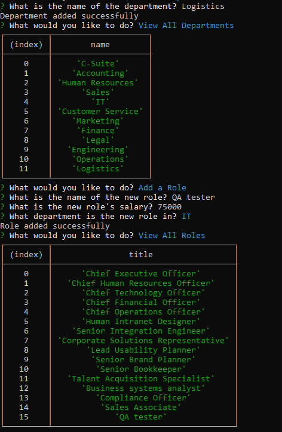

# Employee-Tracker

## Overview
This is a simple Employee Management System built using Node.js, MySQL, and Inquirer. The system allows you to perform various actions related to managing departments, roles, and employees within a company.

## Table of Contents
* [Getting Started](#getting-started)
* [Features](#features)
* [Usage](#usage)
* [Features](#features)
* [Technology Stack](#technology-stack)
* [License](#license)
* [Screenshots and Video Walkthrough](#screenshots-and-video-walkthough)

## Usage
Once the application is running, you will be prompted with a list of actions you can perform. Choose an action using the arrow keys and press Enter. Follow the prompts to complete each action.

### Features
The features include:

* View All Departments
* View All Roles
* View All Employees
* Add a Department
* Add a Role
* Add an Employee
* Update an Employee Role
* Update Employee Manager
* View Employees by Manager
* View Employees by Department
* Delete Department
* Delete Role
* Delete Employee
* View Total Utilized Budget by Department
* Exit

## Technology Stack

* Inquirer - Interactive command-line user interfaces.
* mysql2 - MySQL client for Node.js.
* Node.js - JavaScript runtime built on Chrome's V8 JavaScript engine.

## License
This project is licensed under the MIT License.

## Screenshots and Video Walkthrough

https://drive.google.com/file/d/1WtVV_YYctD8zYSvAjzmjNAgSsUmC6D3u/view

